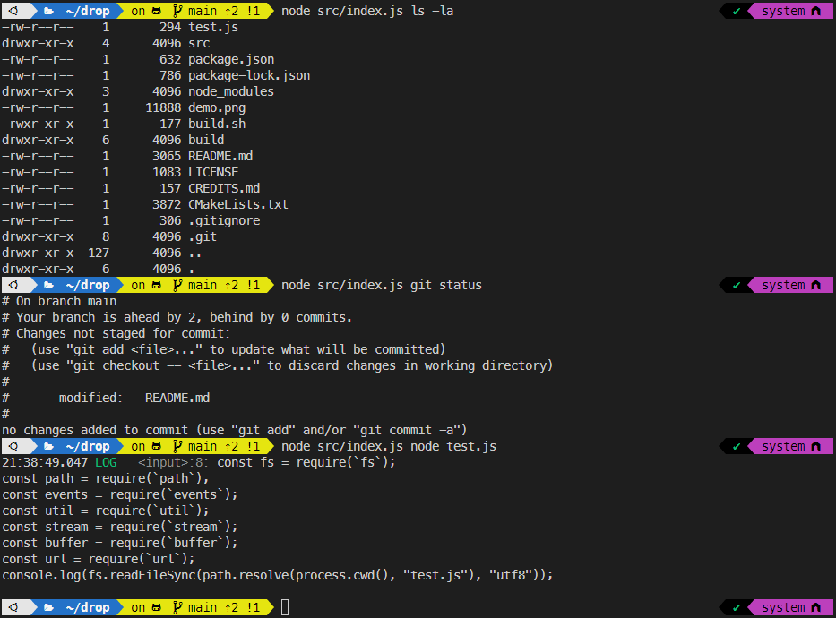

# drop

"drop" is a domain specific JavaScript runtime in WASM, built primarily for file
IO and offline scripting.

"drop" aims to support enough of Node core APIs to run the ADK. Currently it has
`fs`, `path`, `events`, `util`, `stream`, `buffer`, and `url`.

"drop" can be used as a drop-in replacement for Node in the Zorse toolchain, and
can be used to run JavaScript code offline, portable and independent of the host
operating system and environment.

